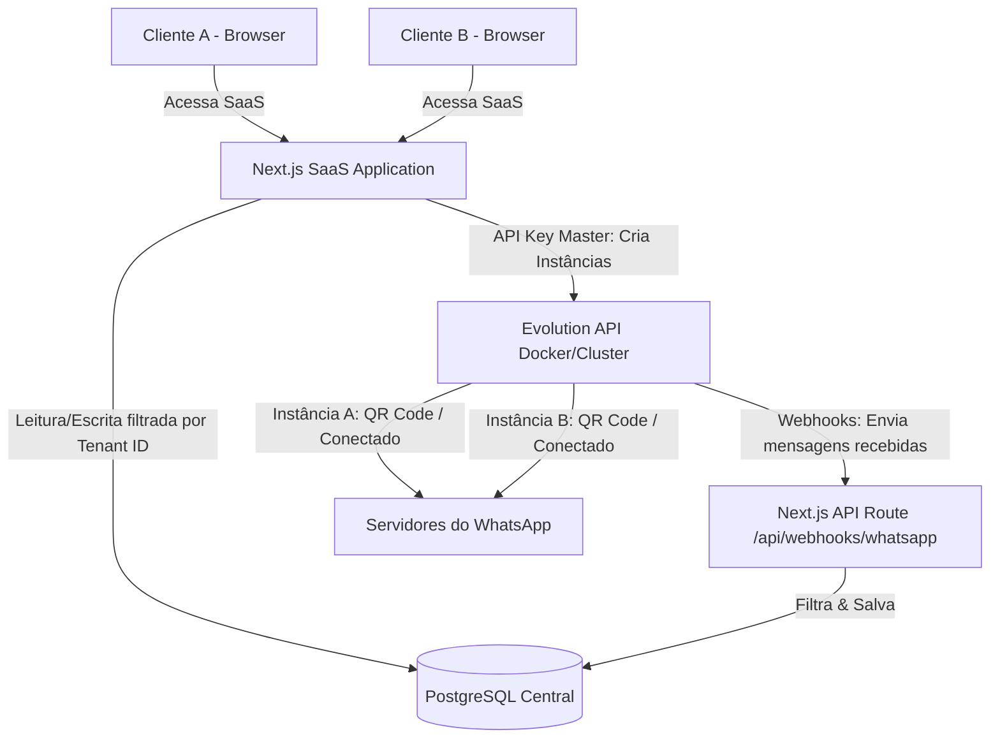

# Arquitetura Multi-Tenant (Multi-Conta) para SaaS com Evolution API

Este documento detalha o planejamento arquitetural completo para construir uma plataforma SaaS Multi-Conta baseada em Next.js e **Evolution WhatsApp API**.

---

## 1. Visão Geral da Arquitetura

Em um SaaS Multi-Conta (Multi-Tenant), vários clientes (tenants) utilizam a mesma aplicação e banco de dados, mas os dados de cada um devem ser completamente isolados. Como a Evolution API suporta a criação de **múltiplas instâncias simultâneas**, ela se encaixa perfeitamente nesse modelo.



---

## 2. Modelagem de Dados (Banco de Dados Central)

Para gerenciar os tenants e as instâncias da Evolution API, a estrutura de tabelas do banco de dados (ex: via Prisma ou Supabase) deve seguir o padrão de **Shared Schema (Esquema Compartilhado com Tenant ID)**:

### Tabela: `tenants` (Organizações/Contas)
Representa a conta da empresa que contratou o SaaS.
```sql
CREATE TABLE tenants (
    id UUID PRIMARY KEY DEFAULT gen_random_uuid(),
    name VARCHAR(255) NOT NULL,
    plan VARCHAR(50) DEFAULT 'free', -- 'free', 'pro', 'enterprise'
    status VARCHAR(50) DEFAULT 'active', -- 'active', 'suspended'
    created_at TIMESTAMP DEFAULT CURRENT_TIMESTAMP
);
```

### Tabela: `users` (Usuários do SaaS)
Usuários que pertencem a um Tenant. Múltiplos usuários podem gerenciar o mesmo Tenant.
```sql
CREATE TABLE users (
    id UUID PRIMARY KEY DEFAULT gen_random_uuid(),
    tenant_id UUID NOT NULL REFERENCES tenants(id) ON DELETE CASCADE,
    name VARCHAR(255) NOT NULL,
    email VARCHAR(255) UNIQUE NOT NULL,
    password_hash VARCHAR(255) NOT NULL,
    role VARCHAR(50) DEFAULT 'member', -- 'admin', 'member'
    created_at TIMESTAMP DEFAULT CURRENT_TIMESTAMP
);
```

### Tabela: `whatsapp_instances` (Instâncias do WhatsApp)
Mapeia qual instância da Evolution API pertence a qual Tenant no SaaS.
```sql
CREATE TABLE whatsapp_instances (
    id UUID PRIMARY KEY DEFAULT gen_random_uuid(),
    tenant_id UUID NOT NULL REFERENCES tenants(id) ON DELETE CASCADE,
    instance_name VARCHAR(100) UNIQUE NOT NULL, -- Ex: 'inst_org_12345'
    status VARCHAR(50) DEFAULT 'disconnected', -- 'connecting', 'connected', 'disconnected'
    phone_number VARCHAR(20),
    qrcode_url TEXT,
    created_at TIMESTAMP DEFAULT CURRENT_TIMESTAMP
);
```

### Tabela: `messages` (Arquivamento de Mensagens)
Salva o histórico de mensagens trocadas em cada instância.
```sql
CREATE TABLE messages (
    id UUID PRIMARY KEY DEFAULT gen_random_uuid(),
    tenant_id UUID NOT NULL REFERENCES tenants(id) ON DELETE CASCADE,
    instance_id UUID NOT NULL REFERENCES whatsapp_instances(id) ON DELETE CASCADE,
    message_id VARCHAR(255) NOT NULL,
    sender VARCHAR(50) NOT NULL, -- Número do remetente
    receiver VARCHAR(50) NOT NULL, -- Número do destinatário
    content TEXT,
    message_type VARCHAR(20) DEFAULT 'text', -- 'text', 'image', 'audio'
    direction VARCHAR(10) NOT NULL, -- 'inbound' (recebida) ou 'outbound' (enviada)
    timestamp TIMESTAMP NOT NULL
);
```

---

## 3. Fluxo de Provisionamento de Instâncias (Multi-Conta)

1. **Criação de Conta**: O cliente se cadastra no SaaS, criando um `tenant_id` e seu usuário.
2. **Solicitação de Conexão**: No painel do SaaS, o cliente clica em "Conectar Novo WhatsApp".
3. **Geração da Instância**:
   - O SaaS gera um nome exclusivo de instância para a Evolution API. Uma boa prática é concatenar o prefixo do SaaS com o `tenant_id` (ex: `saas_tenant_{tenant_id}`).
   - O SaaS faz uma chamada `POST` para `http://localhost:8083/instance/create` enviando a API Key Master no header e o payload:
     ```json
     {
       "instanceName": "saas_tenant_12345",
       "integration": "WHATSAPP-BAILEYS",
       "qrcode": true
     }
     ```
   - O SaaS salva o registro na tabela `whatsapp_instances` vinculando `instance_name` ao `tenant_id`.
4. **Exibição do QR Code**:
   - O SaaS faz um `GET` para `http://localhost:8083/instance/connect/saas_tenant_12345` para obter o base64 do QR Code e exibe na tela do usuário.
5. **Pareamento**: O usuário lê o QR Code com seu celular. O status é atualizado via webhook para `connected`.

---

## 4. Arquitetura de Webhooks (Roteamento Inteligente)

Para receber mensagens e atualizações de status em tempo real de todas as contas, configuramos um **Webhook Global** na Evolution API.

1. **Configuração na Evolution**: No `docker-compose.yml` da Evolution ou via API, definimos o webhook global para apontar para a rota do SaaS:
   - `WEBHOOK_GLOBAL_URL=http://seusaas.com/api/webhooks/whatsapp`
   - `WEBHOOK_GLOBAL_ENABLED=true`
2. **Processamento no SaaS**:
   - O Next.js recebe o payload do webhook na API Route: `/api/webhooks/whatsapp`.
   - **Identificação do Tenant**: O payload da Evolution inclui o campo `instance`. O SaaS faz o parsing do nome da instância (ex: extrai `12345` de `saas_tenant_12345`) ou consulta no banco de dados a tabela `whatsapp_instances` para descobrir qual `tenant_id` é o dono daquela instância.
   - **Ação com Base no Evento**:
     - Se o evento for `connection.update` com status `open`: Atualiza a tabela `whatsapp_instances` para `connected`.
     - Se o evento for `messages.upsert`: Salva a mensagem na tabela `messages` com o `tenant_id` correspondente.

Exemplo de lógica de roteamento em pseudocódigo (TypeScript/Next.js API Route):
```typescript
export async function POST(req: Request) {
  const payload = await req.json();
  const { event, instance } = payload;

  // 1. Encontrar a instância e o tenant correspondente
  const instanceRecord = await db.whatsappInstance.findUnique({
    where: { instance_name: instance }
  });

  if (!instanceRecord) {
    return new Response("Instance not found", { status: 404 });
  }

  const tenantId = instanceRecord.tenant_id;

  // 2. Tratar eventos
  if (event === "messages.upsert") {
    const msgData = payload.data;
    await db.message.create({
      data: {
        tenant_id: tenantId,
        instance_id: instanceRecord.id,
        message_id: msgData.key.id,
        sender: msgData.key.remoteJid,
        content: msgData.message?.conversation || "",
        direction: msgData.key.fromMe ? "outbound" : "inbound",
        timestamp: new Date()
      }
    });
  } else if (event === "qrcode.updated") {
    await db.whatsappInstance.update({
      where: { id: instanceRecord.id },
      data: { qrcode_url: payload.data.qrcode.base64 }
    });
  }

  return new Response("OK", { status: 200 });
}
```

---

## 5. Isolamento e Segurança (CORS & Tokens)

1. **Segurança do Cliente**: O cliente final **nunca** deve saber qual é a API Key Master da Evolution API. Todas as chamadas (criar instância, obter QR Code, deletar) devem ser feitas **do backend do SaaS** para a Evolution API. O front-end do SaaS apenas consome as rotas locais do SaaS (autenticadas via JWT/Sessão do usuário).
2. **Limites do Plano (Rate Limits)**:
   - Antes de enviar chamadas para criar instâncias, o SaaS consulta a tabela `tenants` e verifica se o plano permite mais instâncias (ex: plano Free permite 1 conexão, plano Pro permite 5).
3. **Limpeza de Recursos**: Quando um cliente deleta sua conexão ou cancela o plano, o SaaS chama o endpoint `DELETE` da Evolution API para desalocar a memória/container daquela instância e evitar vazamento de memória.

---

## 6. Plano de Implementação Local do Protótipo Multi-Conta

Para testar este comportamento localmente sem precisar de um Postgres externo ou autenticação complexa de produção:

1. **Armazenamento Local no SaaS**: Simulamos o banco de dados usando **SQLite** (via Prisma) na pasta `saas-evolution`, contendo as tabelas `tenants`, `users` e `whatsapp_instances`.
2. **Simulação Multi-Conta**: Criamos uma tela no SaaS onde o usuário pode alternar entre "Tenant 1 (Empresa A)" e "Tenant 2 (Empresa B)" a partir de um dropdown superior.
3. **Conexões Independentes**:
   - Empresa A criará a instância `saas_tenant_empresaA` no Docker.
   - Empresa B criará a instância `saas_tenant_empresaB` no Docker.
   - Ambas serão exibidas de forma isolada na interface dependendo do Tenant ativo.
